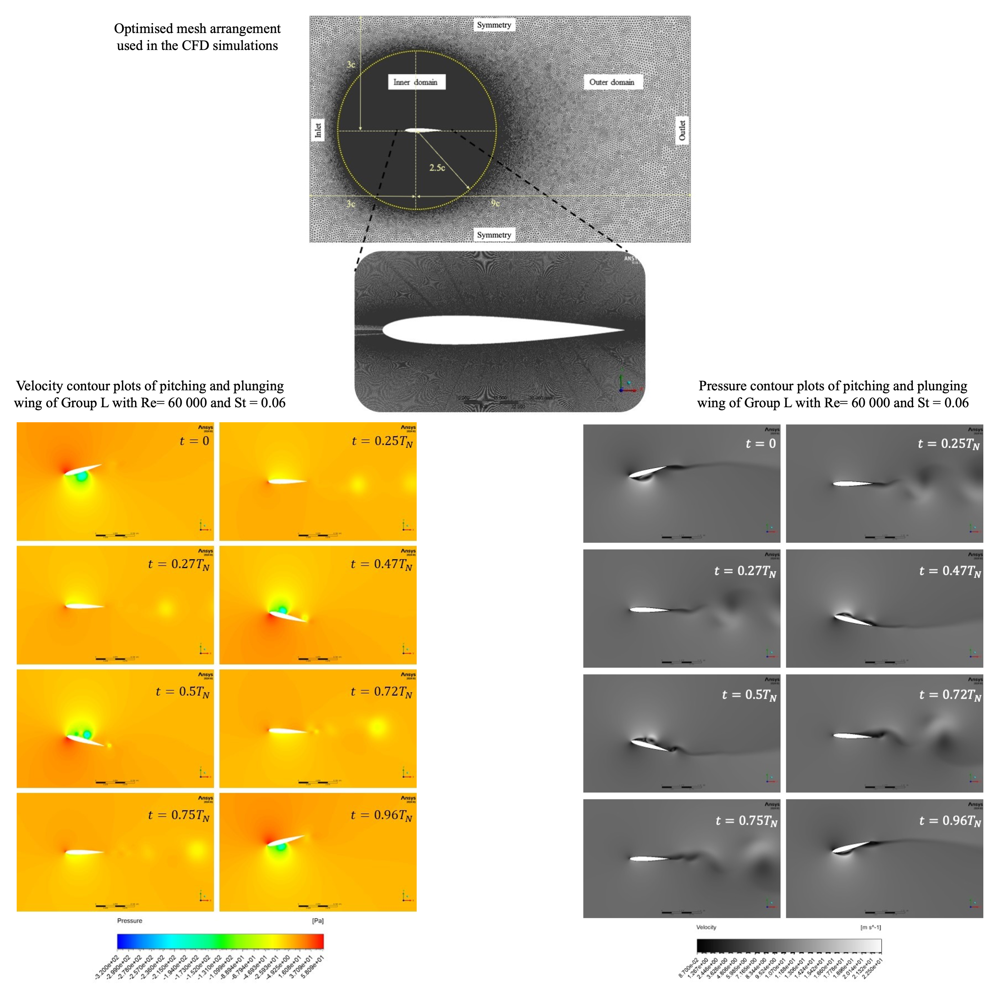

As the research project for the Master of Philosophy degree in mechanical engineering, I selected this research area due to my long-standing interest in aerodynamics and nature. The ultimate aim of the research is to assist future development of Flapping Wing Bioinspired Aerial Vehicles (FWBAVs), small drones that mimic the motion of birds to generate the required lift and thrust for flight.
 
In the quest to develop bioinspired aerial vehicles capable of efficient operation in dynamic environments, transient measurements of aerodynamic forces on pitching and plunging wings are essential. While previous investigations have measured these forces, there remain gaps in knowledge that impede further development of bioinspired aerial vehicles. Overarching characteristics of lift and thrust performances of pitching and plunging wings in varying kinematic scenarios have not been the subject of extensive research. The majority of previous research has concentrated on assessing the performance of custom-developed wing platforms tailored for specific flapping wing micro air vehicle applications. In cases where a standard airfoil shape is employed, investigations have been limited to a few wing flapping frequencies or free-stream velocities. In this research, unsteady aerodynamic forces of pitching and plunging wings in a range of frequencies and free stream velocities inspired by birds are investigated
both experimentally and computationally.
 
The experimental investigation encompasses fourteen different kinematic scenarios spanning Reynolds numbers from 20,000 to 100,000 and Strouhal numbers from 0.02 to 0.1. Complementing this, the computational investigation provides additional insights through time series variations in aerodynamic forces, velocity, and pressure contour for twenty-five kinematic scenarios, including those examined experimentally. The range of Reynolds and Strouhal numbers is derived from measurements taken from birds in forward flapping flight. An experimental apparatus, purposefully designed and developed for this investigation, is used in subjecting a wing with a uniform cross-section of the NACA 0012 airfoil to controlled pitch and plunge motions while simultaneously measuring the aerodynamic forces acting on the wing. The measurements taken using a force sensor are post-processed to compute the time-history variation of lift and thrust coefficients in varying kinematic scenarios. Characteristics of resultant lift and thrust coefficient variations and average values are discussed with existing findings in flapping wing aerodynamics. Gradual decrements of extremum values in transient lift and thrust coefficient variations are observed with increasing Reynolds number and receding Strouhal number values. The mean values of lift and thrust coefficients increase by an average of 35% and 83% respectively with increasing Strouhal number in Reynolds number values of 20 000 and 40 000. But the mean lift coefficient values decrease by an average of 46% with rising Reynolds number while Strouhal number is 0.02 and 0.04. Results indicate that flapping wing aerial vehicles perform efficiently in Reynolds numbers below 40 000 with stability in forward accelerations and altitude changes increasing with rising Reynolds number values.
 

 
The computational investigation was done using Ansys fluent computational fluid dynamics simulation software. After establishing an optimized simulation methodology, a series of simulations were carried out. Aerodynamic force values are exported and postprocessed to develop velocity and pressure contour plots as images and animations to further supplement the experimental and computational results. The characteristic trends observed in the experimental results were confirmed by the computaivtional results. The mean lift coefficient values exhibit an average increase of 31% with rising Strouhal number values, while they decrease by an average of 54% with increasing Reynolds number values. On the other hand, the mean thrust coefficient values demonstrate an average increase of 32% with increasing 𝑆𝑡values and a rise of 11% on average with increasing Reynolds number values. The comparison between experimental and computational results reveals a favourable agreement in the time-history variations of lift and thrust coefficients. The percentile deviation between the mean lift and thrust coefficients of the experimental and computational results is calculated at 12.15%, indicating a reasonably close correlation.
 

 
This research project was supervised by Dr. Nalaka Samaraweera, Prof. Nirosh Jayaweera and Dr. Thusitha Sugathapala of the Department of Mechanical Engineering, University of Moratuwa. The developed experimental apparatus is now being used for both undergraduate practical demonstrations and postgraduate research projects. Findings from this research have been published in multiple conferences and journal publications.

 


 


<!--more-->
