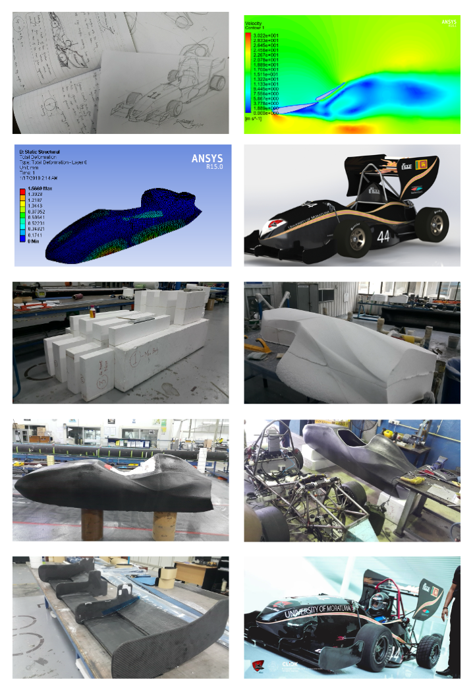

The [Formula Student (FS)](https://en.wikipedia.org/wiki/Formula_Student) is a collection of student engineering competitions held in different countries all around the world, commonly alongside Formula 1 weekends in the respective countries. [Formula Student United Kingdom (FS UK)](https://www.imeche.org/events/formula-student) is widely considered the main event among these. It is organised by IMechE and held annually at Silverstone International racing circuit. FS UK is considered the pinnacle of student engineering competitions and is usually attended by more than a hundred student teams from Universities all around the world.
  
For the first time in Sri Lanka in 2016, a student team named “Team SHARK Racing” from the University of Moratuwa successfully designed, developed and competed in the FS UK 2016 event. They achieved extraordinary success in the event and secured awards in “Dedication for Formula Student” and “Best Driver”. Following their success, I got the opportunity to join the next team of students preparing for the 2017 event as a junior member of the group. My responsibility as the assistant engineer of the powertrain was to design and develop the heat transfer unit (Radiator, Air duct and relevant accessories). Moreover, all junior members assisted senior members in manufacturing tasks. After numerous sleepless nights, the team successfully completed and tested the car in Sri Lanka. However, due to financial difficulties, we were unable to attend the FS UK 2017 event.
  
Undeterred by the setbacks, the new 2018 team developed a robust plan to design and develop a new car and to compete in FS UK 2018 event. The team appointed me as the team leader, which I consider a great honour and responsibility. As a small team of only twenty members, all twelve senior members of the group had to cover multiple job roles. Apart from my responsibilities as the team leader, I was the chief engineer of aerodynamics and composite development. With the help of team members, I was able to design a complete aerodynamic package for the 2018 car, including body panels, front and rear multi-element wings, underbody and sidepods optimised for downforce generation, drag reduction and heat transfer. The design and optimisation process included concept generation, 3D modelling, CFD simulations, and result-based design improvements. The development process was assisted by DIMO PLC as our main sponsor and Southern Spars International LTD as the technology sponsor for Carbon Fibre composite development. With the assistance of the helpful staff members of Souther Spars, my team and I successfully developed the complete aerodynamic package using carbon fibre composites. Moreover, multiple other components of the car were also developed using carbon fibre composites, including the driver seat and steering wheel, engine intake plenum, and radiator housing.
  

  
Overcoming countless challenges, the team successfully competed in FS UK 2018 event at Silverstone. The “Fire Demon” car grabbed everyone’s attention at the event with its striking livery, which was an homage to the traditional artistry of Sri Lanka. The team completed all dynamic events and achieved an overall 30th place in the competition from more than a hundred teams from all over the world. Other noteworthy achievements are being the 2nd best team from Asia, and 10th place in the Engineering Design category. 
  
The legacy of the Formula Student competition in Sri Lanka is firmly planted at the University of Moratuwa by this project. Currently, students from the Department of Mechanical Engineering, University of Moratuwa, are developing an all-electric formula student car as [“Team Falcon E Racing”](https://falconeracing.lk/). 
  


  


<!--more-->
